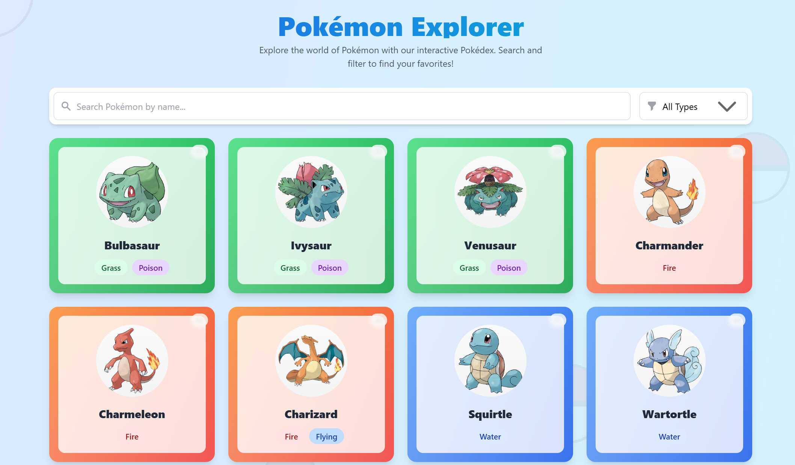
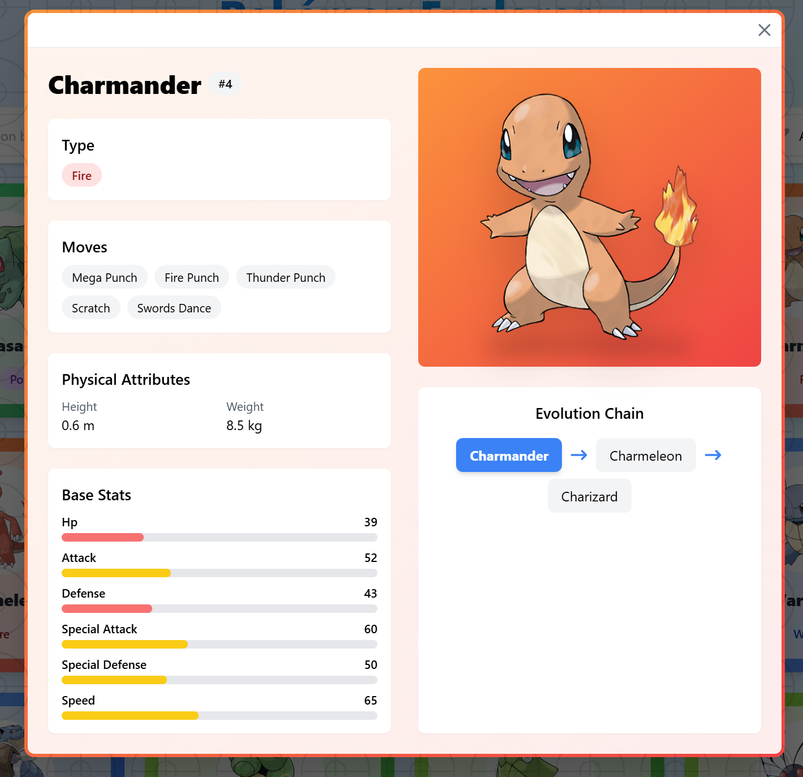

# Pokémon Explorer ✨

A fun web application where you can discover and search through the original 150 Pokémon!

## ✨ What Can You Do?

- Browse through all the original 150 Pokémon
- Search for your favorite Pokémon by name
- Filter Pokémon by their types (Fire, Water, etc.)
- View beautiful cards with Pokémon details
- Works great on phones, tablets, and computers!

<b>See More Features</b> (Click to expand)

### What You'll See on Each Pokémon Card
- Pokémon's name and picture
- ID number (just like in the Pokédex!)
- Type badges with matching colors
- Cool hover effects when you mouse over

### Easy Ways to Find Pokémon
- Type a name to see matches instantly
- Select types from the dropdown menu
- Combine search and filters to find exactly what you want

## 🚀 Try It Now!

**[Open Pokémon Explorer](https://pokemon-explorer-liart.vercel.app/)**

## 📱 Screenshots

Show me how it looks! (Click to expand)

### Main View

## ❓ FAQ

<b>How many Pokémon can I see?</b>

Currently, you can browse through the original 150 Pokémon from Generation 1.

<b>Where does the Pokémon data come from?</b>

All Pokémon information comes from the free PokeAPI, which contains official Pokémon data.

<b>Can I save my favorite Pokémon?</b>

Not yet, but we're planning to add this feature soon!

<b>Does it work on mobile?</b>

Yes! The app is designed to work great on phones, tablets, and computers.

## 🔮 Coming Soon

We're working on some exciting new features:
- Save your favorite Pokémon
- Dark mode for night-time browsing
- Compare Pokémon side by side
- Add newer generations of Pokémon
- Create your dream Pokémon team

## 👋 About the Creator

Made with ❤️ by [Noviciusss](https://github.com/noviciusss)

Love the app? Have suggestions? [Let me know!](https://github.com/noviciusss/pokemon-explorer/issues)

---

  <a href="https://github.com/noviciusss/pokemon-explorer">View on GitHub</a> | 
  <a href="https://pokemon-explorer-liart.vercel.app/">Try Live Demo</a>

